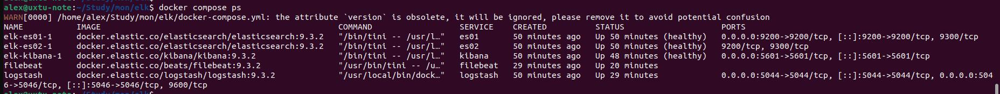
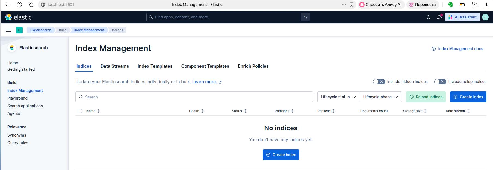
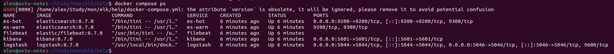
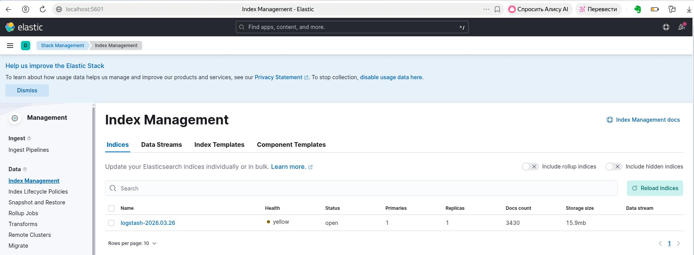

## ELK homework ##  

### Task 1 ###  
Пользуясь документацией с сайта Elastic поднял связку Elastic + Kibana через docker compose, убрав узел es03, чтобы соответствовать хоть чуть чуть заданию.  
При подъеме столкнулся с отказом эластика запускаться - нашел решение с vm.max_map_count = 262144  
Посмотрел имеющуюся информацию по настройке Filebeat и Logstash и честно подсмотрев в каталог help добавил в compose запуск контейнеров logstash и filebeat.
В help либо умышленно были допущены ошибки, либо параметры устарели.  
В итоге исправил тип container на filestream в filebeat.yml  
```  
filebeat.inputs:
  - type: filestream
    id: fs-container-id
    paths:
      - '/var/lib/docker/containers/*/*.log'
```  
А так же добавил api. в logstash.yml  
```  
api.http.host: "0.0.0.0"
```  
И само собой в output пайплайна logstash поправил хост, на котором слушает эластик  

  
  
Все контейнеры работали длительное время, но данные в Elastic не передавались. 
Дело было в том, что композ от эластика изначально включал всю возможную безопасность, включая TLS и аутентикацию.  
Попытался перенастроить эластик и кибану для отключения всех опций безопасности, рассмотрел перенастройку логстэша на использование аутентикации и поддержи SSL, однако такие настройки явно не укладываются в 4 часа практической работы.  
В результате, с учетом прочих исправлений взял материал для запуска из каталога help.  
Почти все сразу заработало, кроме logstash, который ломался из-за недостатка памяти.  
Поменял объем памяти, отведенной для Java  
```
  logstash:
    image: logstash:8.7.0
    container_name: logstash
    environment:
      - "LS_JAVA_OPTS=-Xms1G -Xmx1G"
```
Проблема решена.  
  
  

